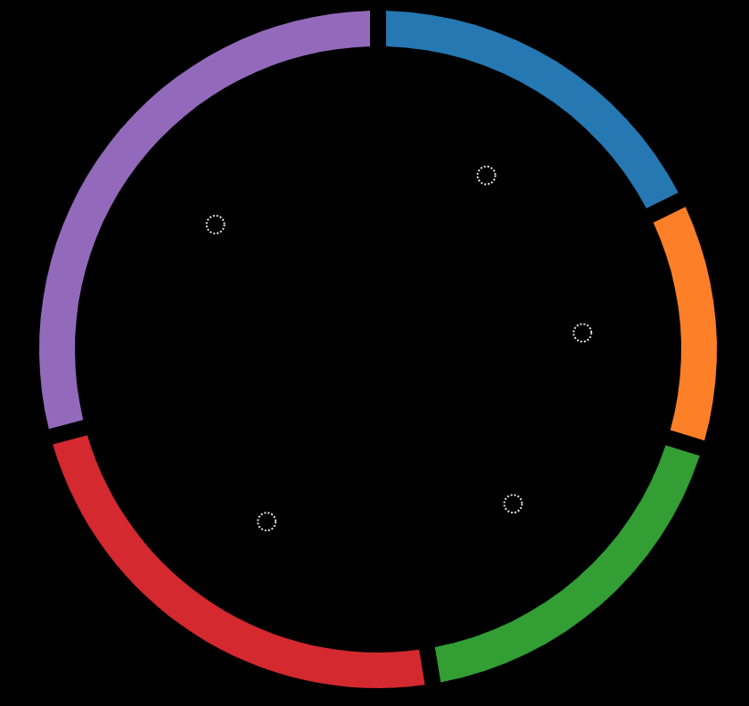
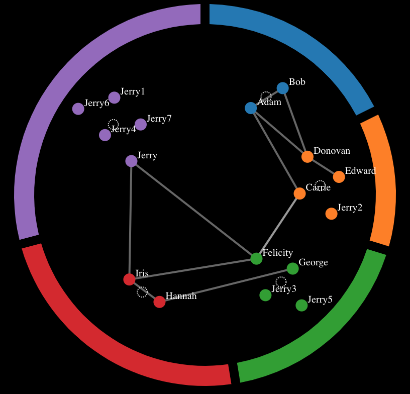

# ARCS-GRAPH-LAYOUTS
This demo is inspired by [TopicPanorama: a Full Picture of Relevant Topics](http://www.shixialiu.com/publications/TopicPanorama/paper.pdf).
I combine pie layout with force layout to visualize clusting data.

<p align="center">
  
  </br>
  step 1: pie layout
</p>
<p align="center">
  
</br>
  step 2: force layout + pie layout
</p>

## Project setup
```
npm install
```

### Compiles and hot-reloads for example development
```
npm run start:dev
```

### Compiles and minifies for example production
```
npm run build
```
### Dependence libs
```
lodash
d3
...
```

## Donate

If you find this project useful, you can buy author a glass of juice :tropical_drink:
donate
<p align="center">
 
 
</p>

Copyright (c) 2019-present liqiusheng
